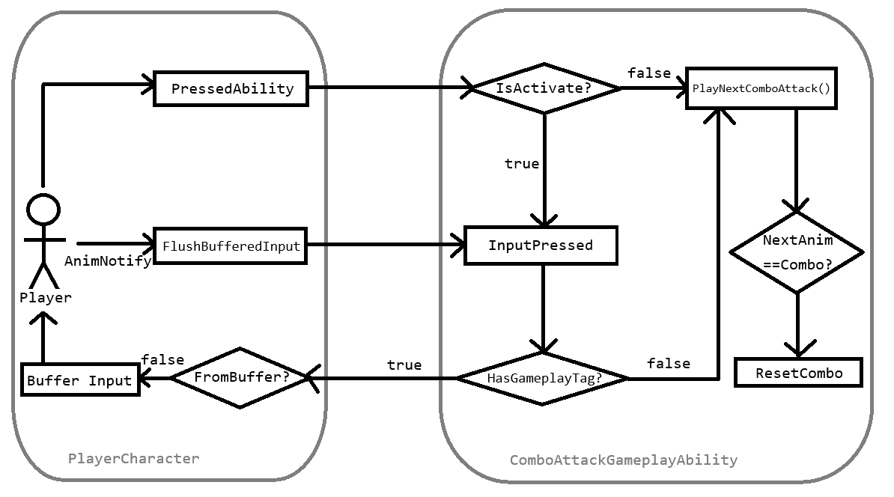

# Combo Attack System

## Synopsys

The **Combo Attack** system in 3d action game usually consists of the most basic part of player's
offensive behavior. Commonly, this system doesn't contain a complicated triggering condition or
input mechanism. I goaled to implement a combo system that ensures the coherent player behavior in
any type of inputs (Rapid press, in-time press) with input buffering system.

## Definition of Player State

Before I start implementing, I needed to define a *player state* whether the combo attacks are
allowed or blocked. After observing some commercial games, I figured out that players can *skip*
the current combo before the animation fully ends. Players either AFK to observe proper recovery
animation being played or skip the recovery time and go to the next combo by pressing key.

### `StateWindowAnimNotifyState`

I made a custom notify state to give and get rid of GameplayTags when the animation enters and
exits the notify state. Then, made players can only do combo attacks when the tag doesn't exist.
This prevented an awkward animation skip while the player is preparing or swinging a weapon.

## Workflow

Combo Attack uses GAS(Gameplay Ability System). Let's get through what happens in each stage.

- ## `PlayerCharacter` part

### PressedAbility

This is the primary entry point of combo system started by a user input. The first ability activation
always pass through this stage. Inside the `PressAbility()` method, it checks whether the ability is
activated. `Ability activation == true` means combo animation montage is being played. Otherwise,
player's not playing combo attacks.

### FlushBufferedInput

If the player input fails at firing an ability, the input is buffered for a short time to wait the
player state be available again. `FlushBufferedInput()` method triggers the most recent ability that
failed at activating it.

### BufferInput

In this node, it records input id with a timestamp provided by `GetWorld()->GetTimeSeconds()`. The buffered
information is used to activate an ability by `FlushBufferedInput`.

- ## `ComboAttackGameplayAbility` part

### InputPressed 

GameplayAbility method override when the player press the ability keybind when ability is activated.
Since I designed the combo attack system to cancel attack animations' recovery time, the ability
should be activated again, playing the next combo animation again.

The combo ability is not activatable in the time window defined by `StateWindowAnimNotifyState`. In
that window, the player has `State_ComboLocked` tag. As seen on the flow chart, the stored
`State_ComboLocked` leads to "Buffer Input", where records ability ID to activate when the player is
in available state. But you need to watch closely the "FromBuffer?" node, which prevents buffering
input that is caused by the buffered input—an infinite cycle of buffering!

### PlayNextComboAttack()

In this node, the ability plays combo attack montage and increases the counter. The montage is not
directly played via the player's skeletal mesh, but it creates `UAbilityTask_PlayMontageAndWait` proxy,
a delegator that ends the ability when montage is finished or interrupted.

But we can guess playing a next combo anim montage will abnormally trigger the old ability task. So
I managed the old task as a pointer variable and then call `ExternalCancel()` to prevent ability
being finished in unintended way.

### ResetCombo

Combo counter is reset when the player is idle or interrupted. In other words, the counter should be
0 if the next montage is NOT a next combo anim montage. This simply conducted by cancellation of
`UAbilityTask_PlayMontageAndWait`, because combo reset callback never called for a canceled task.