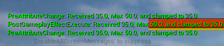
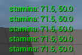
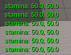

# AttributSet

체력, 스태미나처럼 액터 라이프사이클의 중요한 부분을 차지하는 변수값들은 일반 필드들로 파편화되어 선언하면 유지보수에 애로사항이 생길
수 있다. 따라서 공통된 특성(최대, 최소값 존재, 값 변경에 따른 이벤트)을 공유하는 이들 속성값들은 하나의 모듈로 관리되는것이 유리하다.

**Gameplay Abilities** 플러그인에는 이러한 변수들을 각각 `Attribute`로 취급하여 하나의 `AttributeSet`으로 구성하는 기능을
제공한다. 각 `Attribute`들은 최대값, 최소값, 기본값을 가질 수 있고 Modifier를 적용하여 속성 값의 변화를 효율적으로 추적, 관리할 수 있다.
(예를 들면 플레이어의 기본 공격력이 10이고 현재 +5의 공격력 버프 스킬이 적용되어 있다면, 최종 공격력은 15로 계산될 것이고 버프 스킬
의 지속시간이 끝난다면 Modifier를 제거하여 기본 공격력 10으로 쉽게 복구할 수 있다.)

또한 언리얼 엔진의 Replication(동기화 시스템)의 제어를 받으므로 클라이언트-서버 방식의 멀티플레이 구현에도 높은 이점을 제공한다.
개발자가 Replication Policy만 설정해주면 복잡한 네트워킹 함수 없이도 `Attribute`들의 변경 사항을 클라이언트에 동기화 할 수 있다.

___

## 플레이어와 몬스터에 공통된 AttributeSet 정의

Beadurinc 프로젝트는 소울류 게임들의 플레이스타일을 모방하기 위해 만들어진 프로젝트이므로 그러한 게임 장르에 자주 사용되는 속성값인
체력과 스태미너를 다음과 같이 정의하였다.

**LivingAttributeSet.h**
```c++
class BEADURINC_API ULivingAttributeSet : public UAttributeSet
{
    ...
    /// Define a data instance for character's health
    UPROPERTY(BlueprintReadOnly, Category = "Attributes", ReplicatedUsing = OnRep_Health, meta = (AllowPrivateAccess))
    FGameplayAttributeData Health;
    ATTRIBUTE_ACCESSORS_BASIC(ULivingAttributeSet, Health);
    
    /// Define a data instance for character's stamina
    UPROPERTY(BlueprintReadOnly, Category = "Attributes", ReplicatedUsing = OnRep_Stamina, meta = (AllowPrivateAccess))
    FGameplayAttributeData Stamina;
    ATTRIBUTE_ACCESSORS_BASIC(ULivingAttributeSet, Stamina);
}
```

`ATTRIBUTE_ACCESSORS_BASIC` 매크로는 Attribute와 관련된 Getter와 Setter등의 함수를 자동으로 생성시켜준다. 그리고 속성값들이
변경될 때 각 클라이언트의 UI에서도 변경 사항이 반영되어야 하므로 `ReplicatedUsing`을 사용하여 RPC를 통해 동기화 시켜주었다.

___

## 최대, 최소값 설정

일반적으로 플레이어와 몬스터들의 속성값은 최대값이 정해져 있다. `FGameplayAttributeData` 내부에서 최소 & 최대값을 자동으로
설정해주는 기능을 찾을 수 없었으므로 `TMap`을 통해 해당 기능을 직접 구현하기로 하였다.

**LivingAttributeSet.h**
```c++
class BEADURINC_API ULivingAttributeSet : public UAttributeSet
{
    ...
    /** Called before any change is applied to attribute value */
    virtual void PreAttributeChange(const FGameplayAttribute& Attribute, float& NewValue) override;
    
    /** Information about max value of Attributes */
    TMap<FGameplayAttribute, FGameplayAttribute> MaxValues;
}
```

**LivingAttributeSet.cpp**
```c++
ULivingAttributeSet::ULivingAttributeSet()
{
    MaxValues.Add(GetHealthAttribute(), GetMaxHealthAttribute());
    MaxValues.Add(GetStaminaAttribute(), GetMaxStaminaAttribute());
}

...

void ULivingAttributeSet::PreAttributeChange(const FGameplayAttribute& Attribute, float& NewValue)
{
    Super::PreAttributeChange(Attribute, NewValue);
    
    if (const FGameplayAttribute* MaxAttribute = MaxValues.Find(Attribute))
    {
        // Clamp the newly received value
        NewValue = FMath::Clamp(NewValue, 0.0F, MaxAttribute->GetNumericValue(this));
    }
}
```

생성자에서 현재 체력/스태미나 값을 담당하는 Attribute와 최대 체력/스태미나 값을 담당하는 Attribute를 매핑해주었다. 그런 다음
`PreAttributeChange`와 `PostGameplayEffectExecute`에서 새로 받아온 값을 Clamp해주었는데 함수가 두개인 이유는 Attribute가
악세서리 매크로로 생성된 함수와 `GameplayEffect`로 인해 변경될 때 호출되는 이벤트가 다르기 때문이다.

p.s. 인터넷 상의 많은 블로그, 포스팅에서 `PreAttributeChange`와 `PostGameplayEffectExecute`를 분리하여 Clamp 처리를 해주어야
`GameplayEffect`로 수정된 값이 적용된다고 명시되어 있었다. 하지만 직접 테스트해본 결과 `PreAttributeChange`는 `GameplayEffect`로
값을 변경할때도 정상적으로 호출되며 `PostGameplayEffectExecute`가 호출될때도 클램핑을 하면 다시 `PreAttributeChange`가 호출되기
때문에 총 3번의 클램핑이 일어나게 된다. 따라서 `PostGameplayEffectExecute`는 Attribute 값 변화에 따른 이벤트 발생용으로 사용하기로
하였다.



___

## Attribute 값 변경하기

Attribute의 값은 `ATTRIBUTE_ACCESSORS_BASIC` 매크로로 생성된 함수를 통해 수정할수도 있지만 **Gameplay Ability** 시스템이
유도하는 방식은 `GameplayEffect`를 사용하는 것인데, 이는 게임 내 다양한 상호작용 이벤트 (파티클, 사운드) 와 맞물려서 동작할 수 있기
때문이다.

체력과 스태미나에 대한 변경은 캐릭터가 히트 판정을 받았을 때 일어나는데, 이는 [HitReact](HitReact.md)에 자세하게 소개되어 있다. 이
문서에서는 Attribute값 변화에 대한 내용만을 중점적으로 설명한다.

**HitReactGameplayAbility.cpp**
```c++
void UHitReactGameplayAbility::ActivateAbility
(
    ...
)
{
    if (OwnerACS->HasMatchingGameplayTag(StateGameplayTags::State_Blocking))
    {
        ...
        
        // Applying stamina deflation
        // Sets up GE context
        FGameplayEffectContextHandle GEContext = OwnerACS->MakeEffectContext();
        GEContext.AddInstigator(Attacker, Attacker);
        GEContext.AddSourceObject(Attacker->GetWeaponActor());
        
        // Create GE spec handler to apply damage
        FGameplayEffectSpecHandle SpecHandle = OwnerACS->MakeOutgoingSpec(UGE_StaminaDamage::StaticClass(), 1.0F,GEContext);
        
        if (SpecHandle.IsValid())
        {
            // Apply x0.15 stamina deflation when parried
            SpecHandle.Data.Get()->SetSetByCallerMagnitude(DataTags::DataTag_Stamina, -Attacker->GetWeaponActor()->GetStaminaDamage() * (Parried ? 0.15F : 1.0F));
            OwnerACS->ApplyGameplayEffectSpecToSelf(*SpecHandle.Data.Get());
        }
    }
    else
    {
        ...
        
        // Applying damage
        // Sets up GE context
        FGameplayEffectContextHandle GEContext = OwnerACS->MakeEffectContext();
        GEContext.AddInstigator(Attacker, Attacker);
        GEContext.AddSourceObject(Attacker->GetWeaponActor());
        
        // Create GE spec handler to apply damage
        FGameplayEffectSpecHandle SpecHandle = OwnerACS->MakeOutgoingSpec(UGE_HealthDamage::StaticClass(), 1.0F, GEContext);
        
        if (SpecHandle.IsValid())
        {
            SpecHandle.Data.Get()->SetSetByCallerMagnitude(DataTags::DataTag_Health, -Attacker->GetWeaponActor()->GetHealthDamage());
            OwnerACS->ApplyGameplayEffectSpecToSelf(*SpecHandle.Data.Get());
        }
    }
}
```

`GameplayEffect`를 발생시키기 위한 Context Object를 `MakeEffectContext`를 사용하여 생성하였다. 그리고 이벤트 발생 주체에 대한
정보를 설정하였다.

`Attribute` 값에 대한 수정은 `GameplayEffect` 내의 **Modifier**를 통해 이루어진다. 여기서 `SetSetByCallerMagnitude` 함수와
`DataTags::DataTag_Health`라는 `GameplayTag`를 사용하여 동적으로 Modifier의 수정값(Magnitude)을 설정하였다.

**GE_HealthDamage.cpp**
```c++
UGE_HealthDamage::UGE_HealthDamage()
{
    ...
    
    FSetByCallerFloat SetByCaller;
    SetByCaller.DataTag = DataTags::DataTag_Health;
    Modifier.ModifierMagnitude = FGameplayEffectModifierMagnitude(SetByCaller);
    
    Modifiers.Add(Modifier);
}
```

`GE_HealthDamage` 클래스를 보면 `FSetByCallerFloat`라는 컨텍스트가 `DataTags::DataTag_Health` 태그로 등록되어 `Modifiers`에
적용되어 있는 것을 볼 수 있다. (`GE_StaminaDamage` 도 동일) 이는 `SetSetByCallerMagnitude` 함수와 파라미터로 넘겨진
`GameplayTag`를 통해 값을 동적으로 받겠다는 의미이다.

*결과*


Attribute를 위젯에 바인딩하는 문서는 [이곳](UI.md)을 참조

___

## 버그발생 & 수정

스태미나 재생을 위한 GameplayEffect를 적용하였을 때, 스태미나가 무한으로 리젠되는 버그를 발견하였다. 이 버그는 `GetStamina()` 값이
계속해서 Max값을 리턴하고 있었으므로, 무언가 이상하다 느낀 것은 장시간 스태미나가 재생성되면 다음 스킬에서 스태미나 소모가 발생하지
않았기 때문에 알아챌 수 있었다.

UnrealEngine의 `AttributeSet` 소스코드를 뒤져보던 중 `BaseValue`와 `CurrentValue` 두 개의 변수가 있는 것을 발견하였다. 이
부분이 의심스러워서 두 값을 모두 출력해 보기로 하였다.

**PlayerCharacter.cpp**
```c++
void APlayerCharacter::Tick(float DeltaSeconds)
{
    Super::Tick(DeltaSeconds);
    
    const ULivingAttributeSet* LAS = CastChecked<ULivingAttributeSet>(AbilitySystemComponent->GetAttributeSet(ULivingAttributeSet::StaticClass()));
    
    GEngine->AddOnScreenDebugMessage(-1, 2.0F, FColor::Green, 
        FString::Printf(
            TEXT("stamina: %.1f, %.1f"),
            LAS->GetStaminaAttribute().GetGameplayAttributeData(LAS)->GetBaseValue(),
            LAS->GetStaminaAttribute().GetGameplayAttributeData(LAS)->GetCurrentValue()
        )
    );
    ...
}
```



CurrentValue의 값은 50으로 설정되있는데 반해 BaseValue의 값은 계속해서 늘어나고 있었다. 이 오류는 앞서 언급한 `PreAttributeChange`
함수 설정 부분과 관련이 있었다.

언리얼 공식 문서에 따르면 `PreAttributeChange`는 Attribute의 일시적인 값 변경에만 적용된다고 명시되어 있다. 이는 일시적으로
유지되는 버프 스킬등을 위해 디자인된 것으로 `GameplayEffect` 가 해제되면 Attribute는 BaseValue를 기준으로 다시 CurrentValue를
계산한다. 하지만 스태미나 재생은 영구적인 것이므로 BaseValue를 수정하기 때문에 Clamp가 적용되지 않고 있던 것이다.

앞서 `PostGameplayEffectExecute`를 사용하지 않기로 결정한 이유는 `GameplayEffect`를 통해 Attribute를 수정해도
`PreAttributeChange`가 여전히 호출되는 것을 확인했기 때문이다. 하지만 이는 CurrentValue에만 해당하는 것으로 실제로
`PostGameplayEffectExecute`를 사용하면 BaseValue도 같이 수정할 수 있는 것을 알아내었다. 하지만 여전히 `PreAttributeChange` ->
`PostGameplayEffectExecute` -> `PreAttributeChange` 이 3중 호출이 불필요하다 느껴졌고, Override할만한 다른 함수가 없는지
찾아보았다.

`AttributeSet` 소스 코드를 탐색하던 중 `PreAttributeBaseChange`라는 함수를 찾을 수 있었다. 이름에서 알 수 있듯 BaseValue를
변경하고자 할 때 호출되는 함수이며 정확히 원하는 타이밍에 호출되는 함수였다.

**LivingAttributeSet.cpp**
```c++
void ULivingAttributeSet::PreAttributeBaseChange(const FGameplayAttribute& Attribute, float& NewValue) const
{
    Super::PreAttributeBaseChange(Attribute, NewValue);
    
    if (const FGameplayAttribute* MaxAttribute = MaxValues.Find(Attribute))
    {
        // Clamp the newly received value
        NewValue = FMath::Clamp(NewValue, 0.0F, MaxAttribute->GetNumericValue(this));
    }
}
```

`PreAttributeChange`와 동일한 로직으로, NewValue가 레퍼런스 인자이기 때문에 새로 정해질 값을 조정 가능하다.



수정사항 적용시 CurrentValue와 BaseValue모두 50으로 고정되는 것을 확인할 수 있다.