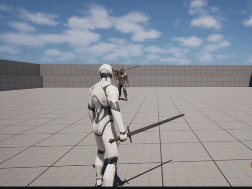
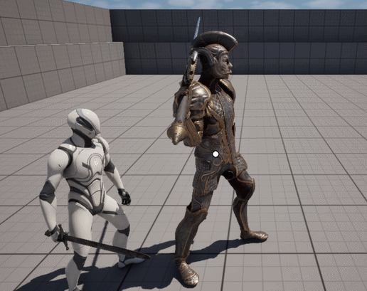
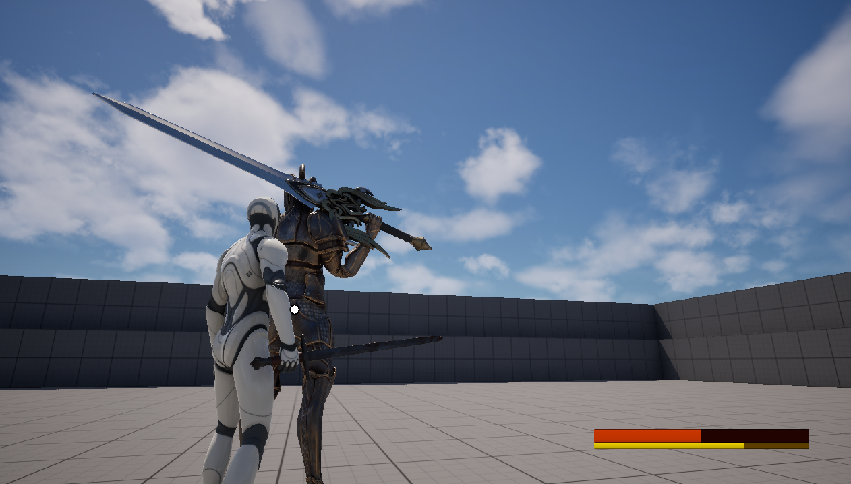
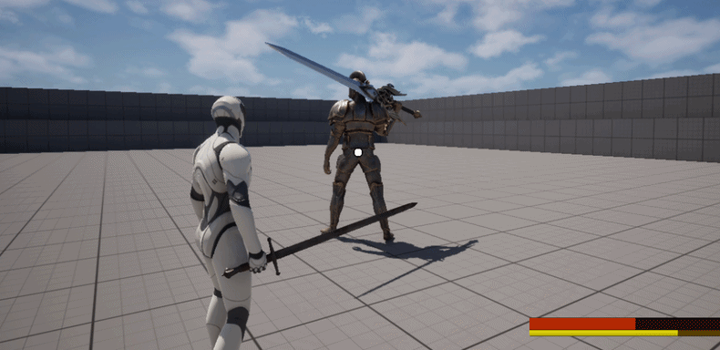
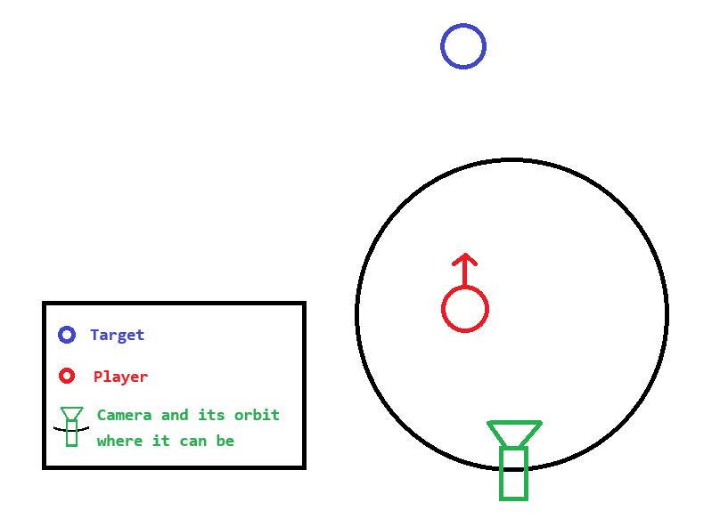
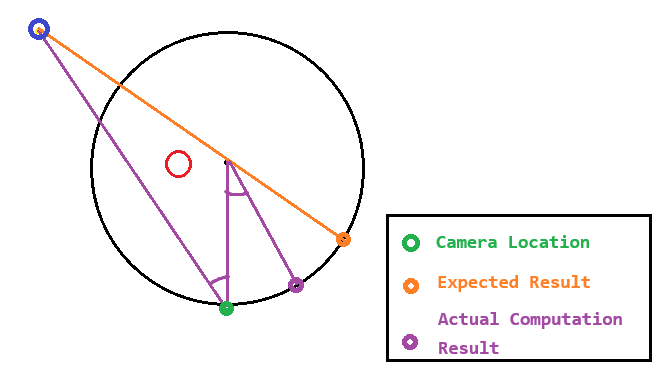
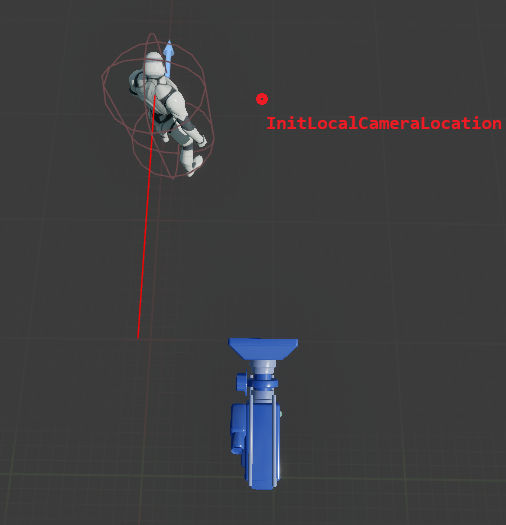
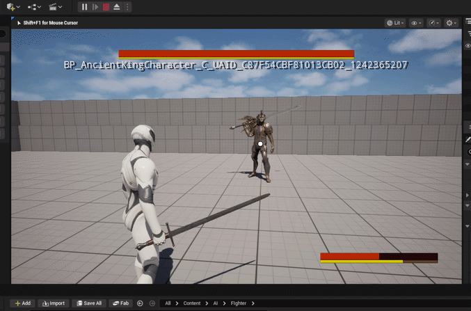

# Camera Lock-on

- 3D 액션 게임에서 카메라 락온을 사용하면 화면의 포커스가 타겟에 고정됨
- 플레이어는 시점을 변경하는 대신 전투 관련 조작에 집중하여 몰입할 수 있음
- 주로 컨트롤러 사용자를 위해 고안됨

## Toggling Camera Lock

카메라 락온이 활성화 되기 위해선 다음과 같은 조건을 설정하였다
> - 추적 대상이 스크린 안에 있어야 함
> - 추적 대상이 유효한 상태 (대체로 HP가 0이상인 살아있는 상태)이어야 함
> - 추적 대상이 일정 거리 내에 있어야 함

카메라 락온을 활성화/비활성화 하는 키는 따로 분리하지 않고 누를 때마다 토글되도록 구현하였다.

**PlayerCharacter.cpp**
```c++
bool APlayerCharacter::IsValidLockOnTarget(const ACharacter* Target) const
{
    // Invalid (object destroyed or pending kill)
    if (!IsValid(Target))
    {
        return false;
    }
    
    double DistanceSqr = (GetActorLocation() - Target->GetActorLocation()).SquaredLength();
    
    // Distance too far
    if (DistanceSqr > LockOnDistance * LockOnDistance)
    {
        return false;
    }
    
    return true;
}

void APlayerCharacter::ToggleCamLock(const FInputActionValue& Value)
{
    if (!bLockingOnCamera)
    {
        // To get a local player's controller, pass 0 to PlayerIndex
        const APlayerController* PC = Cast<APlayerController>(GetController());
        
        if (!PC)
        {
            return;
        }
        
        // Store the viewport size
        int32 ViewX, ViewY;
        PC->GetViewportSize(ViewX, ViewY);
        
        ACharacter* ClosestActorFromCrosshair = nullptr;
        double ClosestDistanceOnScreenSqr = 1000000000.0;
        
        // Define the types to look for
        TArray<TEnumAsByte<EObjectTypeQuery>> ObjectTypes;
        ObjectTypes.Add(UEngineTypes::ConvertToObjectType(ECC_Pawn));
        
        TArray<AActor*> IgnoreActors;
        IgnoreActors.Add(this);
        TArray<AActor*> ActorsWithinBound;
        
        // Only gets actors within preset distance
        UKismetSystemLibrary::SphereOverlapActors(
            GetWorld(), 
            GetActorLocation(), 
            LockOnDistance,
            ObjectTypes, 
            ACharacter::StaticClass(), 
            IgnoreActors, 
            ActorsWithinBound
        );
        
        // Iterates all actors
        for (AActor* Actor : ActorsWithinBound)
        {
            ACharacter* Character = Cast<ACharacter>(Actor);
            
            // Skip the character that is invalid or if it's myself
            if (!IsValidLockOnTarget(Character) || Character == this)
            {
                continue;
            }
            
            FVector2D ActorLocationInScreen;
            
            // Get a x, y coordinate of an actor in the screen 
            const bool ConvertSucceeded = PC->ProjectWorldLocationToScreen(
                Character->GetActorLocation(),
                ActorLocationInScreen
            );
            
            // A case that the target is not on the screen
            if (!ConvertSucceeded)
            {
                continue;
            }
            
            // Transform the left-top coord system into center-center
            ActorLocationInScreen.X -= ViewX / 2;
            ActorLocationInScreen.Y -= ViewY / 2;
            
            // Calculates distance
            const double DistanceFromCrosshairSqr = ActorLocationInScreen.SquaredLength();
            
            // Calculate the distance between center of the screen and an actor, if true, memorize the actor and distance
            if (DistanceFromCrosshairSqr < ClosestDistanceOnScreenSqr)
            {
                ClosestActorFromCrosshair = Character;
                ClosestDistanceOnScreenSqr = DistanceFromCrosshairSqr;
            }
        }
        
        // If found any nearest target, set locking true
        if (ClosestActorFromCrosshair != nullptr)
        {
            LockCamera(ClosestActorFromCrosshair);
            return;
        }
    }
    
    UnlockCamera();
}
```

`IsValidLockOnTarget` 함수는 캐릭터가 타겟으로 설정 가능한지 여부를 반환한다. `ToggleCamLock`은 카메라 락온 상태를 토글링하기
위하여 월드 내 배치된 액터들을 순회하며 타겟 설정 가능 여부를 검사한다. 우선 `ProjectWorldLocationToScreen` 함수는 월드 좌표계를
화면 좌표계로 변환하는 함수이며 반환되는 `bool` 값은 좌표계 변환이 성공적으로 이루어졌는지를 의미한다. 리턴값이 `false`면 해당
좌표가 가시 부피 내에 존재하지 않음을 의미한다.

락온 버튼을 눌렀을 때 화면 내의 랜덤한 액터를 설정하기보단 크로스헤어 (화면 중앙에 표시되는 눈금자)에서 제일 가까운 대상을 타겟으로
설정하는 것이 기능적 일관성 측면에서 유리하다. `ClosestActorFromCrosshair`와 `DistanceFromCrosshairSqr`는 가장 가까운 캐릭터를
검색하기 위한 지역 변수로 화면 중앙 기준으로 거리를 측정하여 락온 타겟을 설정한다.

## Updating Camera Transform

타겟이 설정되면 카메라의 Transform을 매 틱마다 업데이트하여 화면 중앙에 타겟이 위치할 수 있도록 하였다. 이때 화면이 너무 빠르게
스내핑 되지 않도록 보간 함수를 쓰는 것이 중요하다.

**PlayerCharacter.cpp**
```c++
void APlayerCharacter::UpdateCameraLock(float DeltaTime)
{
    APlayerController* PC = Cast<APlayerController>(GetController());
    if (!PC) return;
    
    // Get the camera rotation
    FVector CameraLoc = PC->PlayerCameraManager->GetCameraLocation();
    
    // Add the half height of the target's collider to aim at the center of the target
    FVector TargetLoc =	LockingOnCharacter->GetActorLocation();
    TargetLoc.Y += LockingOnCharacter->GetCapsuleComponent()->GetScaledCapsuleHalfHeight() * 0.3;
    
    // Calculate rotator from vector camera -> target
    FRotator DesiredRot = (TargetLoc - CameraLoc).Rotation();
    FRotator CurrentRot = PC->GetControlRotation();
    
    // Get interpolated rotator by current rotation -> desired rotation
    FRotator NewRot = FMath::RInterpTo(CurrentRot, DesiredRot, DeltaTime, 10.f);
    
    // Set to the calculated rotation
    PC->SetControlRotation(NewRot);
    
    // Set camera rotation with the same principle
    FVector ActorLoc = GetActorLocation();
    FRotator DesiredActorRot = (TargetLoc - ActorLoc).Rotation();
    FRotator CurrentActorRot = GetActorRotation();
    FRotator NewActorRot = FMath::RInterpTo(CurrentActorRot, DesiredActorRot, DeltaTime, 10.f);
    
    // Do not rotate pitch
    NewActorRot.Pitch = CurrentActorRot.Pitch;
    
    SetActorRotation(NewActorRot);
}
```

타겟의 중앙과 크로스헤어 중앙을 일치시키기 위하여 타겟의 `CapsuleComponent`의 높이를 기반으로 중앙 위치를 계산하였다. 그리고
목표 회전값을 계산하기 위해 `타겟 위치 - 카메라의 위치` 벡터를 계산하여 이를 `FRotator`로 변환하였다.

반환받은 `FRotator`를 그대로 적용할 수도 있지만 이는 화면 전환이 너무 빠르게 수행되어 플레이하는 유저로 하여금 3D 울렁증을 유발할
수도 있다. 따라서 `RInterpTo` 함수를 사용해 회전을 보간하여 적용하도록 하였다.

액터 또한 타겟을 바라보기 위하여 같은 원리로 보간 함수를 적용하여 회전값을 변경하도록 설정하였다. 여기서 중요한 것은 현재 카메라가
TPS 시점 뷰이기 때문에 플레이어의 위치에서 약간 왼쪽으로 치우친 곳에 위치해있기 때문에 각각 `GetCameraLocation()`과
`GetActorLocation()`을 사용하여 목표까지의 회전값을 계산했다는 점이다.

*결과*



___

## 수정사항

근접 전투 테스트 도중에 몬스터가 화면 정중앙에 놓일 수 없는 위치에 있으면 카메라가 지속적으로 회전하는 문제가 발생하였다.



이는 수학적인 오류로 카메라의 *현재* 위치를 기준으로 타겟을 바라보는 각도를 계산하기 때문인데 카메라의 현재 위치는 이전 계산 결과값
에 의해 변하므로 무한 루프가 발생하는 것이다. 따라서 이를 해결하기 위해 락온 각도 계산을 위한 고정된 시작 위치를 구할 필요가 있었다.

첫 번째 시도에서는 액터의 위치를 기준으로 각도를 계산하였으나 이는 스크린 상의 몬스터가 너무 왼쪽으로 치우처진 문제가 있었다. 이는
TPS 게임 특성상 카메라가 플레이어보다 오른쪽에 위치해 있기 때문이다.



두 번째로 떠올린 방법은 카메라의 초기 로컬 위치(플레이어 좌표계 기준)을 따로 저장하여 락온 각도 계산에 사용하는 것이었다. 이는 첫
번째 방법보다 상대적으로 가운데 위치에 락온 타겟을 배치할 수 있으며 초기 위치는 락온 각도 계산 결과값에 영향을 받지 않으므로 무한 회전
문제에서도 자유롭다.

**PlayerCharacter.h**
```c++
class APlayerCharacter : public AFighterCharacter
{
...
    /** Initial camera location from player coord system. Used in calculating camera lock angle */
    FVector InitLocalCameraLocation;
...
```

**PlayerCharacter.cpp**
```c++
void APlayerCharacter::BeginPlay()
{
    Super::BeginPlay();
    
    FVector CameraLocal = GetActorRotation().UnrotateVector(FollowCamera->GetComponentLocation() - GetActorLocation());
    
    // Save the initial camera local location
    InitLocalCameraLocation = CameraLocal;
}

void APlayerCharacter::UpdateCameraLock(float DeltaTime)
{
    ...
    // Calculate world location of camera initial point
    FVector WorldLocalCamera = GetActorRotation().RotateVector(InitLocalCameraLocation);
    
    // Get the camera rotation
    FVector LockOnStart = GetActorLocation() + WorldLocalCamera;
    ...
}
```

`BeginPlay` 함수에서 카메라 로컬 위치 계산시 액터의 회전값을 `UnrotateVector` 함수를 통해 플레이어 좌표계 기준 위치를 계산하였다.
락온 각도 업데이트시에는 다시 액터의 회전값을 벡터에 적용하여 카메라 초기 위치의 월드 좌표를 구하였다.

*결과*


___

## 수정사항2

수정사항1의 결과를 보면 타겟이 플레이어의 위치와 가까울 수록 화면 왼쪽으로 치우쳐지므로 여전히 화면의 오른쪽 공간을 활용하지 못하는
느낌이다. 따라서 화면 정중앙이 타겟의 위치가 아닌 타겟과 플레이어의 중간에 위치하면 좋겠다 생각하였다.

이를 위해 카메라가 바라볼 위치를 타겟의 위치 대신 플레이어와 타겟 사이, 즉.

> 플레이어 위치벡터 + (타겟 위치벡터 - 플레이어 위치벡터) / 2

를 기준으로 카메라 회전을 계산하도록 하였다.

또한, 플레이어의 시점과 카메라 시점이 일치하지 않는 TPS 카메라의 특수성을 고려하여, 현재 계산에 오차가 없는지 정확히 검증하여 보기로
하였다.



위 그림은 현재 Camera Lock-On 시스템이 어떻게 카메라의 각도를 계산하는지를 도식화한 것이다. 카메라는 Blueprint에 설정된 초기 위치
벡터를 기준으로 액터의 회전값에 곱해져 World space상의 위치를 구한다. 카메라 락온 확성화시 액터는 항상 타겟을 바라보므로, 액터의 회전
값에 곱해져 월드 좌표계를 구하는것 까지는 좋으나, 카메라의 초기 위치 자체가 문제가 있음을 알 수 있었다.



현재 회전값은 카메라 초기 위치의 월드상 좌표 위치를 기준으로 계산된다. 하지만 이 계산이 원하는 목표 지점을 화면 정 중앙에 놓지
않는다는 문제가 있는데 이는 회전값이 카메라가 아닌 Spring Arm에 적용된다는 사실에 기인한다 (그림의 보라색 원). 현재 계산된 회전값은
초록색 점을 기준으로 하는데 이 회전값을 `SetControlRotation()` 함수를 통해 적용하면 카메라는 검은 원을 따라 이동한다. 따라서
회전값의 계산은 카메라 회전축의 중앙이 되어야 우리가 원하는 주황색 점으로 카메라를 위치시킬 수 있다.

```c++
void APlayerCharacter::BeginPlay()
{
    ...
    
    // Remove the backward translation
    // The calculation of the rotation for camera lock-on should be based on the center of the camera orbit, not the
    // final location of relative camera position in world space coord.
    //
    // By removing the spring arm length, we can get the center of the circle that the camera draws. This point will
    // calculate the correct rotation to locate the lock-on destination point to the center of the screen applied to
    // the spring arm.
    InitLocalCameraLocation.X = 0;
}
```

이를 위해 카메라의 초기 Relative Position을 구할 때 Spring Arm 컴포넌트의 길이를 제거하도록 하였다. 따라서
`InitLocalCameraLocation`은 카메라를 회전시키는 피벗의 상대 위치를 저장하도록 하였다.



그 다음 카메라 락온을 Update하는 함수를 다음과 같이 수정하였다.

```c++
void APlayerCharacter::UpdateCameraLock(float DeltaTime)
{
    APlayerController* PC = Cast<APlayerController>(GetController());
    if (!PC) return;
    
    // Sets actor rotation
    // Decoupled from camera rotation since actor eye position is different from camera position
    // Calculates in the same way, using (target - eye).Rotation()
    FRotator DesiredActorRot = (LockingOnCharacter->GetActorLocation() - GetActorLocation()).Rotation();
    FRotator CurrentActorRot = GetActorRotation();
    FRotator NewActorRot = FMath::RInterpTo(CurrentActorRot, DesiredActorRot, DeltaTime, 8.f);
    
    // Won't rotate in pitch
    NewActorRot.Pitch = CurrentActorRot.Pitch;
    SetActorRotation(NewActorRot);
    
    // Calculate world location of camera initial point
    // Reused 'DesiredActorRot' instead of 'GetActorRot()' so it's not affected by ongoing interpolation
    FVector WorldLocalCamera = DesiredActorRot.RotateVector(InitLocalCameraLocation);
    
    // Get the camera world location where to start calculating lock-on
    FVector LockOnStart = GetActorLocation() + WorldLocalCamera;
    
    // Find a "middle point" of player and target actor 
    FVector TargetLoc =	GetActorLocation() + (LockingOnCharacter->GetActorLocation() - GetActorLocation()) / 2;
    
    // Calculate rotator from vector camera -> target
    FRotator DesiredRot = (TargetLoc - LockOnStart).Rotation();
    FRotator CurrentRot = PC->GetControlRotation();
    
    // Get interpolated rotator by current rotation -> desired rotation
    FRotator NewRot = FMath::RInterpTo(CurrentRot, DesiredRot, DeltaTime, 8.f);
    
    // Set to the calculated rotation
    PC->SetControlRotation(NewRot);
}
```

주요 변경사항으로는 Actor의 회전을 먼저 계산하였는데 이는 `DesiredActorRot`을 재사용하여 카메라 락온 회전값 계산 시 보간중인 값 대신
최종적인 회전값을 계산하기 위해서이다.

그 다음 `LockOnStart` 값은 다음과 같이 계산된다.

> (액터의 위치) + [ (카메라 피벗의 초기 위치벡터) x (액터 -> 타겟 방향 회전) ]

`TargetLoc`은 락온의 끝 지점으로, 위에서 언급한 바와 같이 다음과 같이 계산된다.

> 플레이어 위치벡터 + (타겟 위치벡터 - 플레이어 위치벡터) / 2

마지막으로 `LockOnStart`에서 `TargetLoc` 방향으로의 회전 값을 Control Rotation으로 설정한다.

---

*결과*

