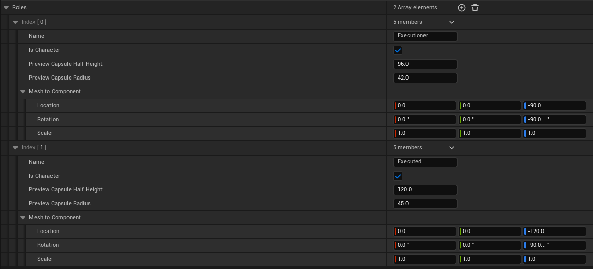
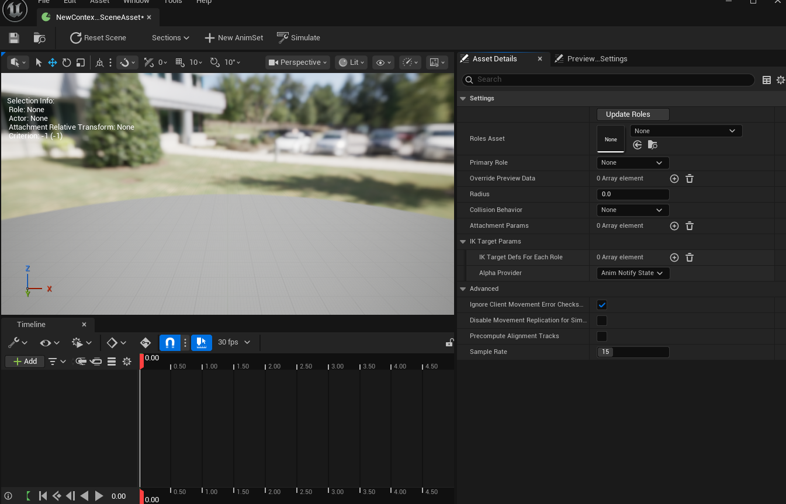
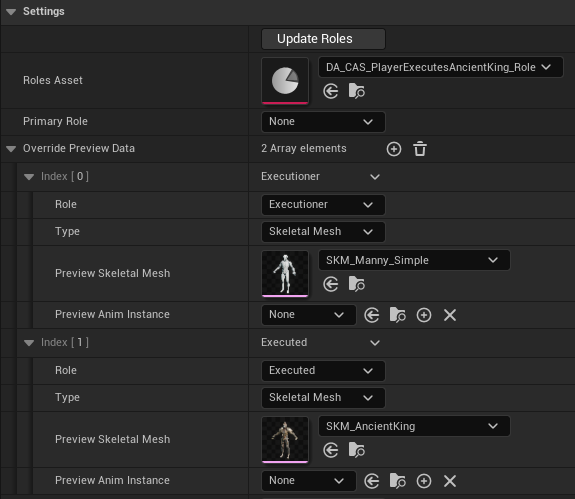
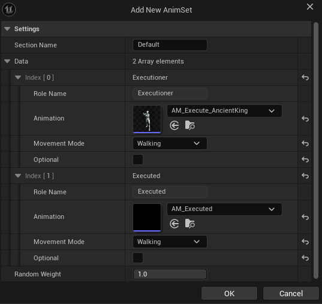
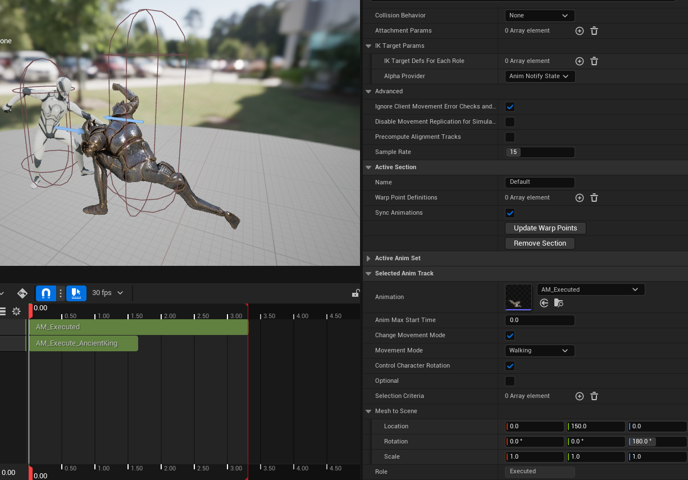
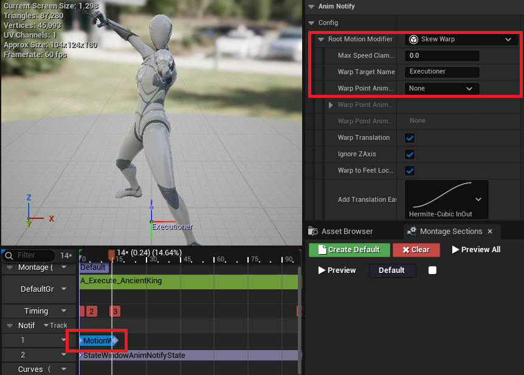
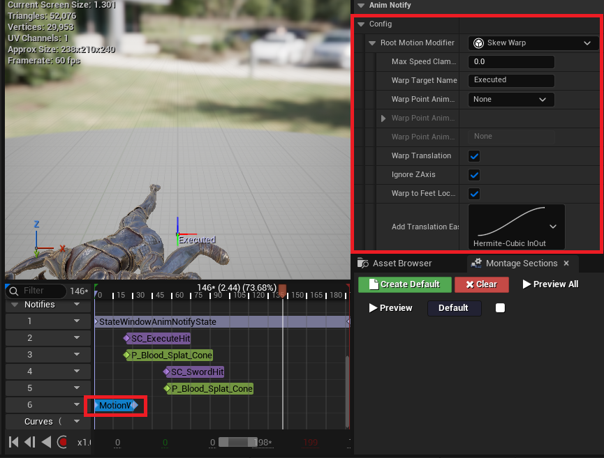
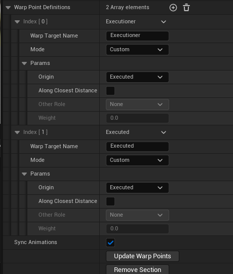

# Contextual Animation

- 레벨 내 캐릭터 간 상호작용을 나타낼 때, 애니메이션의 재생 속도나 캐릭터의 위치를 서로 맞춰야 할 필요가 종종 생김 (캐릭터가 문을 열 때, 벽에 달린 스위치를 내리거나 버튼을 누를 때)
- 언리얼 엔진의 **Contextual Animation** 플러그인은 하나 이상의 액터가 특정 위치를 기준으로 애니메이션 재생을 동기화 할 수 있는 솔루션을 제공함

*한 명의 액터가 지정된 위치(버튼)를 기준으로 재생되는 애니메이션 (World War Z)*


*두명의 액터가 상호작용하는 애니메이션 (Sekiro: Shadows die twice)*


___

## Contextual Anim Scene, Contextual Anim Role Asset

Contextual Animation에 대한 재생 정보는 **Contextual Anim Scene** 라는 에셋에 저장된다. 각 액터들은 데이터 에셋에 정의된 **Role**
에 의해 식별되며 이 Role을 정의하기 위해서 우선 **Contextual Anim Role Asset**이라는 형태의 특수한 데이터 에셋을 정의하여야 한다.



해당 에셋을 열면 여러 개의 Role들을 정의할 수 있는데, 여기서는 몬스터의 스태미나가 0이 되어 취약 상태가 되면 플레이어가 해당 몬스터를
처형하는 애니메이션을 만들 것이므로 플레이어 역할의 *Executioner*와 몬스터 역할의 *Executed*를 정의하였다. **IsCharacter** 속성은
해당 액터가 `ACharacter` 를 상속받는 오브젝트인지를 나타내며 **Preview Capsule Half Height** 와 **Preview Capsule Radius**는
액터의 충돌체, 즉 Blueprint에 정의된 `CapsuleComponent`의 크기를 입력하면 된다.

## Setting up Contextual Animation



생성된 Contextual Anim Role Asset을 이용하여 Contextual Animation의 Scene을 구성할 수 있다. 우선 **Role Asset**에 방금 생성한
데이터 에셋을 할당하여 어떠한 Role을 가진 액터들이 Scene에서 재생될지를 결정할 수 있다. 그 다음 **Override Preview Data**에서 해당
Role을 플레이할 액터들의 프리뷰 모델을 설정할 수 있다. 



**Role**은 Contextual Anim Role Asset에서 정의했던 Role을 의미하며 **Preview Skeletal Mesh** 에서 재생할 애니메이션의 뼈대가
되는 Skeleton을 설정해 주면 된다.

그 다음 Scene이 재생될 동안 플레이할 애니메이션을 설정하였다. 화면 상단의 **New AnimSet** 버튼을 누르면 Preview Skeletal Mesh에서
설정한 Skeleton으로 재생할 수 있는 애니메이션 몽타주 목록이 나타난다.





확인 버튼을 누르면 Scene Viewport에 해당 애니메이션을 재생하는 액터들이 나타나는데, 초록색 트랙 버튼을 눌러 액터를 선택하고
**Mesh to Scene** 섹션의 액터 트랜스폼을 설정하여 액터의 위치를 조정할 수 있다.

액터의 위치 설정을 마치면, 해당 Contextual Animation이 재생되는 순간 액터들을 적절한 위치로 이동할 수 있도록 해야 하는데, 이 때
**MotionWarping** 시스템이 이용된다. 이에 대한 자세한 설명은 [MotionWarping](MotionWarping.md) 문서에서 확인할 수 있다.

해당 Scene에서 재생되는 애니메이션 몽타주들에 Motion Warping Notify State를 설정하였다.




마지막으로, 해당 Motion Warp들의 Target Point, 즉 모션 워핑의 목적지를 Contextual Animation이 계산하도록 설정하면 된다. 



**Warp Target Name** 은 해당 모션 워핑을 식별하기 위해 AnimNotifyState 에서 설정한 이름이고, 액터의 위치를 Target Point로
설정하기 위해 **Mode**는 Custom으로 설정하였다.

여기서 중요한 것은 **Origin** 옵션인데, 선택할 수 있는 리스트로 Contextual Anim Role Asset에서 생성한 Role에 대한 이름들이
나열되어 있다. 이것의 의미는 해당 Role을 수행하고 있는 액터의 위치를 Warp Target을 기준으로 한다는 의미이다. 지금 재생하려는 처형
애니메이션은 몬스터가 쓰러진 상태에서, 플레이어가 다가가 칼을 찌르는 애니메이션이기 때문에 몬스터는 가만히 있고 플레이어만 움직이는것이
자연스럽다 생각하였기 때문에 Origin을 모두 **Executed**, 즉 처형 당하는 몬스터를 기준으로 하였다.

### !!중요!! Warp Point Destinations에서 변경 사항이 생기면 하단의 "Update Warp Points"버튼을 눌러야 변경 사항이 저장된다.

## Playing Cotextual Animation

몬스터를 처형할 수 있는 Gameplay Ability, `UExecutionGameplayAbility`를 정의하였다.

**UExecutionGameplayAbility.cpp**
```c++
void UExecutionGameplayAbility::ActivateAbility(const FGameplayAbilitySpecHandle Handle, const FGameplayAbilityActorInfo* ActorInfo, const FGameplayAbilityActivationInfo ActivationInfo, const FGameplayEventData* TriggerEventData)
{
	...
    FContextualAnimSceneBindings ContextualAnimBindings(*ExecutionAnimation, 0, 0);
    
    // Bind each actor with role names
    ContextualAnimBindings.BindActorToRole(*OwnerCharacter, FName(TEXT("Executioner")));
    ContextualAnimBindings.BindActorToRole(*OwnerCharacter->GetAttackTarget(), FName(TEXT("Executed")));
    
    // Start CAS with binding info
    OwnerCharacter->GetContextualAnimSceneActorComponent()->StartContextualAnimScene(ContextualAnimBindings);
}
```

Contextual Animation을 재생하기 위한 `FContextualAnimSceneBindings` 구조체를 선언하여, 필요한 정보를 바인딩하여야 한다. 여기서
*Executioner* 역할을 수행할 액터는 해당 Gameplay Ability의 소유자, 플레이어를 바인딩하였으며, *Executed* 역할을 수행할 액터는
플레이어의 현재 공격 타겟(락온 타겟) 으로 바인딩하였다.

**실행결과**


___

#### 참고자료

https://vorixo.github.io/devtricks/contextual-anim/

https://www.youtube.com/watch?v=A3y4YT9YQI8