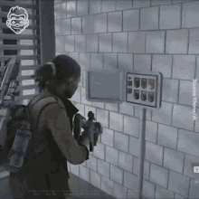
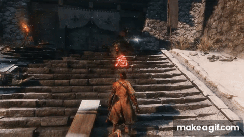

# Contextual Animation

- 레벨 내 캐릭터 간 상호작용을 나타낼 때, 애니메이션의 재생 속도나 캐릭터의 위치를 서로 맞춰야 할 필요가 종종 생김 (캐릭터가 문을 열 때, 벽에 달린 스위치를 내리거나 버튼을 누를 때)
- 언리얼 엔진의 **Contextual Animation** 플러그인은 하나 이상의 액터가 특정 위치를 기준으로 애니메이션 재생을 동기화 할 수 있는 솔루션을 제공함

*한 명의 액터가 지정된 위치(버튼)를 기준으로 재생되는 애니메이션 (World War Z)*

*두명의 액터가 상호작용하는 애니메이션 (Sekiro: Shadows die twice)*

___

# Contextual Anim Scene

언리얼 엔진에서는 여러 캐릭터들의 애니메이션을 함께 작업할 수 있는 에디터를 Contextual Animation 플러그인에서 제공한다

___
#### References

https://vorixo.github.io/devtricks/contextual-anim/