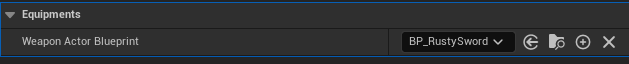
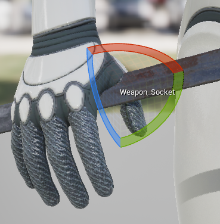
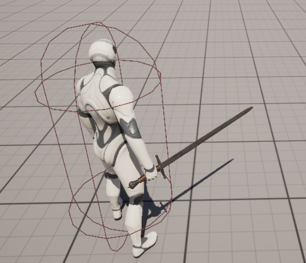

# FighterCharacter 클래스

- 전투와 연관된 행위를 하는 모든 Character를 추상화한 클래스
- `WeaponActor`의 소유자가 되며 **AnimNotify**가 설정된 **Animation Montage**를 통해 공격 타이밍에 충돌체를 활성화함
- `AbilitySystemComponent`의 소유자이며 전투 관련 로직들은 **GameplayAbilities**를 통해 구현되어 있음 (코드 간결성 유지)

**FighterCharacter.h**
```c++
class BEADURINC_API AFighterCharacter : public ACharacter, public IAbilitySystemInterface, public IWeaponHolderInterface
{
    ...
    /** Holding weapon class */
    UPROPERTY(EditAnywhere, BlueprintReadOnly, Category="Equipments", meta = (AllowPrivateAccess = "true"))
    TSubclassOf<AWeaponActor> WeaponActorBlueprint;
    ...
    
    /** Instance holder generated by WeaponActorBlueprint */
    UPROPERTY()
    TObjectPtr<AWeaponActor> WeaponActorInstance;
    ...
```

**FighterCharacter.cpp**
```c++
void AFighterCharacter::BeginPlay()
{
    Super::BeginPlay();
    
    // Spawn a weapon actor and attach to the hand
    if (GetMesh() && WeaponActorBlueprint)
    {
        // Instigator != Owner under certain cases
        // e.g. Player shots an arrow using bow: Arrow's owner == bow, but arrow's instigator == player
        FActorSpawnParameters ActorSpawnParameters;
        ActorSpawnParameters.Owner = this;
        ActorSpawnParameters.Instigator = GetInstigator();
        
        if (AWeaponActor* WeaponActor = GetWorld()->SpawnActor<AWeaponActor>(WeaponActorBlueprint, ActorSpawnParameters))
        {
            // Initialize main hand weapon actor
            WeaponActorInstance = WeaponActor;
            
            if (UCapsuleComponent* CapsuleCollider = WeaponActorInstance->FindComponentByClass<UCapsuleComponent>())
            {
                // Gives "NoCollision" at first since weapon only can hurt other characters when activated by anim notify.
                CapsuleCollider->SetCollisionEnabled(ECollisionEnabled::QueryOnly);
                CapsuleCollider->OnComponentBeginOverlap.AddDynamic(this, &AFighterCharacter::OnMeleeContacts);
            }
            
            WeaponActorInstance->SetActorEnableCollision(false);
            
            // Attach a weapon actor to a skeleton socket
            WeaponActor->AttachToComponent(
                GetMesh(),
                FAttachmentTransformRules::SnapToTargetNotIncludingScale,
                TEXT("Weapon_Socket")
            );
        }
    }
}
```

Blueprint 스크린에서 할당된 `WeaponActorBlueprint`가 유효하면, `BeginPlay` 호출시 해당 액터를 클래스를 통해 호출하며(`SpawnActor`),
소유자의 **MeshComponent**에 "Weapon_Socket" 이라는 소켓에 Attach함





`BeginPlay` 호출시, WeaponActor가 함께 스폰됨

