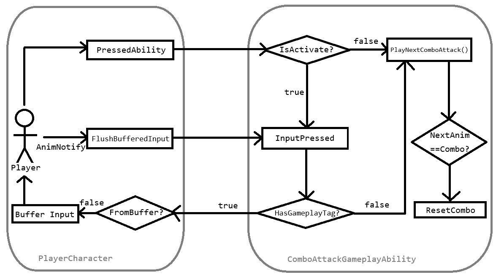

# Input Buffering
- 대전 액션 게임에서 Input Buffering은 입력 불가능한 상태에 입력된 행동을 일정 시간동안 저장하다가 플레이어가 다시
  "입력 가능한" 상태가 될 시 해당 행동을 즉시 실행시킴.
- 이는 플레이어로 하여금 조작 피로감을 완화하고 동작 간의 자연스러운 연결을 보장함

### BUT
- 입력된 행동이 체감상 *꽤 시간이 지난* 후에 발동되었다면 플레이어 입장에서는 불쾌감을 느낄 수 있음
- 입력된 행동이 이후의 입력을 차단한다면, 다시 말해 Input Buffering의 취소가 불가능하다면 플레이어는 불합리함을 느낄 것임
- 이러한 불합리함을 개선하기 위해서 Buffering을 취소하는 기능, 그리고 입력을 얼마나 오랫동안 기억할 것인지에 대한 임계치를
  다양한 상황에서의 테스트를 통해 설정할 필요가 있음

아래 예시는 `PlayerCharacter`내에서 InputBuffering을 핸들링하는 기능이며 후술할 **GameplayAbility**와 연계되어 사용된다.
플레이어의 입력이 GameplayAbility의 활성화에 실패한다면 해당 입력을 `BUFFER_WINDOW_SECONDS` 만큼 기억하였다가, 플레이어가 해당
어빌리티를 다시 사용할 수 있는 상태가 되면 버퍼링된 Input을 즉시 발동시킨다.

**PlayerCharacter.h**
```c++
typedef struct FBufferedInput
{
  int32 InputID;
  double TimeStamp;
} FBufferedInput;
```

**PlayerCharacter.cpp**
```c++
/** Buffer an ability input by InputID */
void APlayerCharacter::BufferInput(int32 InputID)
{
  BufferedInput = {InputID, GetWorld()->GetTimeSeconds()};
}

/** Tryna activate buffered input and flush the buffer */
void APlayerCharacter::FlushBufferedInput()
{
  // Checks buffered inputs in local client (to avoid unnecessary call)
  if (IsLocallyControlled() && HasBufferedInput())
  {
    // Try activating the buffered input if it entered within the buffer window
    if (GetWorld()->GetTimeSeconds() - BufferedInput->TimeStamp <= BUFFER_WINDOW_SECONDS)
    {
      const int32 InputID = BufferedInput->InputID;
      
      // On input buffering activation, we do not care about whether it success activating
      AbilitySystemComponent->AbilityLocalInputPressed(InputID);
      
      // Clear the input buffer
      // This results in clearing any buffered input via GameplayAbility#InputPressed, which is
      // the intention of the system, so input buffering won't create another input buffering again.
      // @see UComboAttackGameplayAbility::InputPressed
      ClearInputBuffer();
    }
  }
}
```

`BufferInput` 함수는 플레이어가 어빌리티를 발동시키는데 실패할 때마다 `FBufferedInput`를 생성하며 기존의 데이터는 지워짐. 이렇게
하면 플레이어의 이전 Input은 자연스럽게 취소됨.

**PlayerCharacter.cpp**
```c++
/** Try activating ability in local client */
void APlayerCharacter::PressAbility(int32 InputId)
{
  // Clear existing Buffered Input to prevent double execution
  if (HasBufferedInput())
  {
    ClearInputBuffer();
  }
  
  if (FGameplayAbilitySpec* Spec = AbilitySystemComponent->FindAbilitySpecFromInputID(InputId))
  {
    if (Spec->IsActive())
    {
      // Trigger InputPressed in GA
      AbilitySystemComponent->AbilitySpecInputPressed(*Spec);
    }
    else
    {
      if (!AbilitySystemComponent->TryActivateAbility(Spec->Handle))
      {
        // Buffer the latest input if it failed in activating ability
        BufferInput(InputId);
      }
    }
  }
}
```

아래의 Flow Chart는 플레이어의 콤보 공격 어빌리티가 InputBuffering에 영향을 받아 작동하는 원리를 보여준다.

