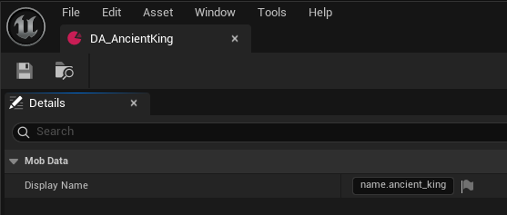
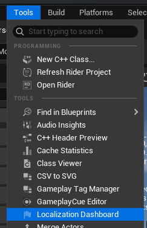
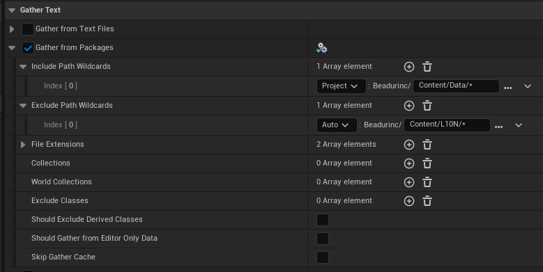
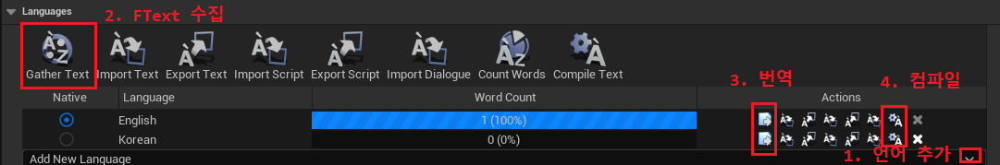
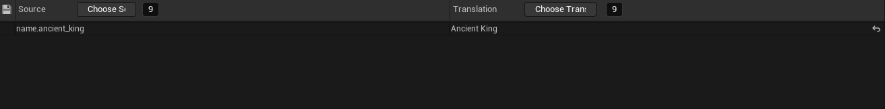
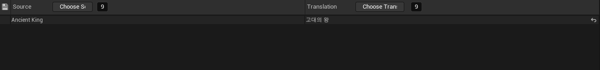
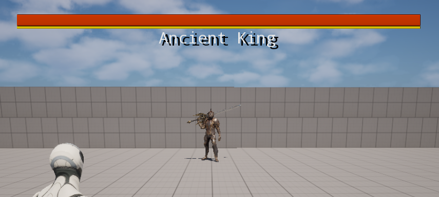
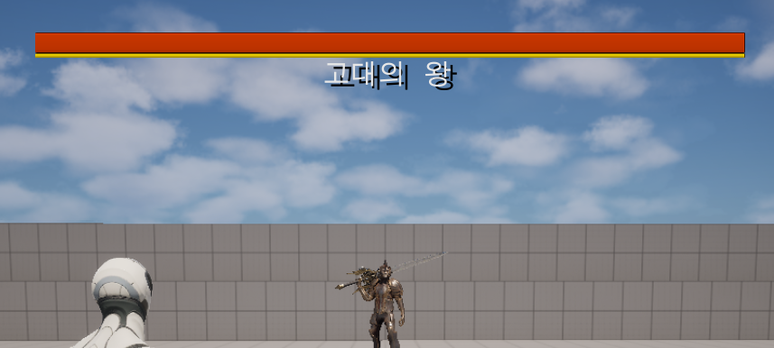

# Localization(현지화)

게임 내에는 무기, 스킬, 몬스터 등 이름을 가진 다양한 오브젝트들이 존재한다. 이들은 플레이어에게 직접적으로 노출되므로 프로그램 내부에서
식별되는 아이디 외에 인간 친화적인 이름을 가져야 할 필요가 있다. 하지만 지구상에는 수 많은 언어들이 존재하므로 글로벌에서 통용되는
게임을 만들고자 한다면 현지에 맞는 언어 적용이 필수적이다.

만약 현지화를 위해 정형화된 시스템이 없다면 이들 이름을 리턴하는 함수에서 현재 설정된 언어를 바탕으로 `if - else` 문이나 `switch`
문으로 처리할수밖에 없는데 이것은 프로그래머 입장에서 악몽과도 같은 일일 것이다. 만약 새로운 언어를 추가하려 한다면 게임 내의 해당
분기문을 찾아 전부 수정해야 하기 때문이다.

언리얼 엔진을 사용한 게임들을 보면 현지화를 지원하는 경우가 많기 때문에 이러한 기능을 지원하는 시스템이 내장되어 있을 것이라
생각하였다. 검색 결과 **Localization Dashboard** 와 **DataAsset**을 사용한 현지화 방법을 찾아낼 수 있었다.

___
## DataAsset

- 특정 시스템에 사용될 데이터를 저장하기 위한 클래스이며, `UDataAsset` 클래스를 상속함
- Blueprint에 변수를 노출할 때와 마찬가지로 UPROPERTY 매크로를 사용하면 DataAsset 에디터에서 편집할 수 있는 변수를 설정 가능
- DataAsset타입으로 생성된 에셋은 모두 Object로 취급됨. Class로 취급되는 Blueprint와 다른 부분

먼저 몬스터의 이름을 저장할 데이터 에셋인 `UMobData` 클래스를 정의하였다.

```c++
class BEADURINC_API UMobData : public UPrimaryDataAsset
{
    ...
    UPROPERTY(EditAnywhere, BlueprintReadOnly, meta = (AllowPrivateAccess = true))
    FText DisplayName;
};
```

그 다음 콘텐츠 브라우저에서 해당 클래스의 DataAsset 오브젝트를 생성하고, 이름을 설정하였다.



해당 필드를 `FText`로 설정한 이유는 후술할 **Localization Dashboard** 에서 감지될 수 있도록 만들기 위하여서이다.

## Localization Dashboard

- 언리얼엔진에서 자체적으로 제공하는 현지화 툴로, 사용자가 미리 지정한 경로 아래에 있는 오브젝트들의 `FText`를 모두 추출하여 각
  언어별로 번역할수 있게 해줌
- 몬스터의 이름을 **DataAsset**에 따로 저장해 두면 Blueprint에서 이름을 설정하는 것 보다 스캔 시간을 줄일 수 있고 불필요한 필드들이
  추출되는 것을 방지할 수 있음



우선 DataAsset 내부의 `FText`를 수집하기 위하여 GatherText 설정을 다음과 같이 해 주었다.



DataAsset 오브젝트들이 존재하는 폴더를 **Include Path Wildcards**에 설정하면 Text Gathering시에 해당 경로 안의 모든 오브젝트를
검사할 것이다.



그 다음 Languages 설정에서 현지화를 위한 세팅을 해주었는데 그 과정은 다음과 같다.

1. 지원할 언어를 추가한다. 여기서는 한국어와 영어를 추가하였다. Native는 따로 설정이 없을 때 기본적으로 적용될 언어이다.
2. Gather Text를 누르면 위 Gather Text 패널에서 설정한 내용을 바탕으로 모든 `FText` 오브젝트를 찾는다.
3. 텍스트 수집이 끝나면 각 텍스트들의 번역된 언어를 설정할 수 있다.
4. 번역 작업이 완료되면 언어를 컴파일 하여야한다. 이 과정이 생략되면 번역이 적용되지 않는다.

3번의 번역 편집 버튼을 누르면 Gather Text단계에서 수집된 텍스트들이 목록에 나타나게 된다. 여기서 각 언어별로 번역된 문자열을
작성하여주면 된다.

*영문 번역 예시*

*한글 번역 예시*


이제 해당 `FText`은 현재 적용된 Locale을 바탕으로 자동으로 번역된 문자열이 출력된다. 테스트를 위해 블루프린트의
Set Current Language And Locale 노드를 사용하였다.

*영문 적용 시*



*한글 적용 시*

