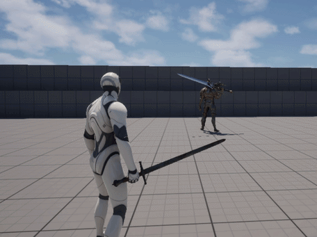

# Motion Warping for AnimMontage

모션 워핑은 루트 모션의 캐릭터 움직임을 월드 내의 오브젝트를 기준으로 재조정 할 수 있게 만든 기술이다. 이는 타겟의 위치를 따라가야
하는 공격 애니메이션등에 적합하다.

**FighterCharacter.cpp**
```c++
AFighterCharacter::AFighterCharacter()
{
    // Create Motion Wraping component
	MotionWarpingComponent = CreateDefaultSubobject<UMotionWarpingComponent>(TEXT("MotionWarpingComponent"));
}
```

애니메이션 몽타주를 이용해 타격하는 모든 Fighter에게 Motion Warping을 적용할 것이므로 AFighterCharacter의 Constructor에서 해당
기능을 담당하는 컴포넌트를 생성해 줌

## MotionWarping 타겟 설정하기

AddOrUpdateWarpTarget 함수를 통해 MotionWarping을 적용할 타겟에 대한 정보를 설정함. 여기서 `AttackTarget`은 현재 활성화된
MotionWarpingTarget을 식별하기 위한 문자열로 NotifyState에서도 설정해 줘야 MotionWarping을 적용할 수 있음.

**PlayerCharacter.cpp**
```c++
void APlayerCharacter::LockCamera(ACharacter* Target)
{
    ...
    MotionWarpingTarget.Location = Target->GetActorLocation();
    MotionWarpingTarget.Name = TEXT("AttackTarget");
    MotionWarpingComponent->AddOrUpdateWarpTarget(MotionWarpingTarget);
}

void APlayerCharacter::UnlockCamera()
{
    ...
    MotionWarpingComponent->RemoveWarpTarget(TEXT("AttackTarget"));
}
```

플레이어가 Camera Lock 기능을 켰을 때 Warping Target 또한 설정하도록 함.

## Max Speed 설정

Motion Warping 이 적용될 때 최대값을 설정해 주지 않으면 캐릭터가 목표까지 순식간에 이동함. 이를 방지하기 위해 NotifyState의
Detail패널에서 설정할 수 있는 Max Speed Clamp Ratio값을 1.5로 설정함. 이는 원본 루트 모션에서 늘어날 수 있는 최대 비율을 의미.

*Clamp 미적용시*


*Clamp 적용시*



## +추가수정

Motion Warping 테스트시에는 보스몹 캐릭터가 가만히 서있어서 알아채지 못했는데 처음 설정한 Target Location이 위치가 바뀌어도 유지
됨. 따라서 Warping Target Location을 Update 함수에서 업데이트 하도록 변경함.

**PlayerCharacter.cpp**
```c++
/** Called on updating camera transform to look at the target */
void APlayerCharacter::UpdateCameraLock(float DeltaTime)
{
    ...
    
    // Update the location of Motion Warping target
    FMotionWarpingTarget MotionWarpingTarget;
    MotionWarpingTarget.Location = LockingOnCharacter->GetActorLocation();
    MotionWarpingTarget.Name = TEXT("AttackTarget");
    MotionWarpingComponent->AddOrUpdateWarpTarget(MotionWarpingTarget);
}
```