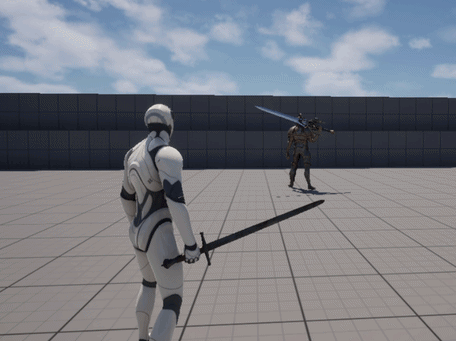

# Motion Warping for AnimMontage

모션 워핑은 루트 모션의 캐릭터 움직임을 월드 내의 오브젝트를 기준으로 재조정 할 수 있게 만든 기술이다. 이는 타겟의 위치를 따라가야
하는 공격 애니메이션등에 적합하다.

**FighterCharacter.cpp**
```c++
AFighterCharacter::AFighterCharacter()
{
    // Create Motion Wraping component
	MotionWarpingComponent = CreateDefaultSubobject<UMotionWarpingComponent>(TEXT("MotionWarpingComponent"));
}
```

애니메이션 몽타주를 이용해 타격하는 모든 Fighter에게 Motion Warping을 적용할 것이므로 `AFighterCharacter`의 Constructor에서 해당
기능을 담당하는 컴포넌트를 생성해 주었다.

## MotionWarping 타겟 설정하기

AddOrUpdateWarpTarget 함수를 통해 Motion Warping을 적용할 타겟에 대한 정보를 설정하였다. 여기서 `AttackTarget`은 현재 활성화된
MotionWarpingTarget을 식별하기 위한 문자열로 NotifyState에서도 설정해 줘야 MotionWarping을 적용할 수 있다.

**PlayerCharacter.cpp**
```c++
void APlayerCharacter::LockCamera(ACharacter* Target)
{
    ...
    MotionWarpingTarget.Location = Target->GetActorLocation();
    MotionWarpingTarget.Name = TEXT("AttackTarget");
    MotionWarpingComponent->AddOrUpdateWarpTarget(MotionWarpingTarget);
}

void APlayerCharacter::UnlockCamera()
{
    ...
    MotionWarpingComponent->RemoveWarpTarget(TEXT("AttackTarget"));
}
```

플레이어가 **Camera Lock** 기능을 켰을 때 Motion Warping Target Location 또한 설정하도록 하였다.

## Max Speed 설정

Motion Warping 이 적용될 때 최대값을 설정해 주지 않으면 캐릭터가 목표까지 순식간에 이동하는 문제가 있다. 이를 방지하기 위해
NotifyState의 Detail패널에서 설정할 수 있는 Max Speed Clamp Ratio값을 1.5로 설정하였다. 이는 원본 루트 모션에서 늘어날 수 있는
최대 비율이 1.5배가 된다는 것을 의미한다.

*Clamp 미적용시*


*Clamp 적용시*


___
## 추상화를 사용하여 플레이어와 몬스터 모두에게 공통적으로 Motion Warping 적용하기

Motion Warping은 플레이어의 공격 뿐만 아니라 몬스터의 공격 애니메이션에도 적용되어야 한다. 플레이어의 Warping Target은 카메라
락온이 활성화 될때 설정되지만 몬스터는 `AIController`에 의해 플레이어를 감지할 때 생성되어야 한다. 이를 위해서 현재 공격 타겟을
반환하는 함수를 `AFighterCharacter` 에 순수 가상 함수로 만들어주었다.

**AFighterCharacter**
```c++
class BEADURINC_API AFighterCharacter : public ACharacter, public IAbilitySystemInterface, public IWeaponHolderInterface
{
    ...
    
    /** Returns a current attacking target. Determined by camera lock for players, by AI perception for monsters. */
    virtual TObjectPtr<ACharacter> GetAttackTarget() PURE_VIRTUAL(AFighterCharacter::GetAttackTarget, return nullptr; );
    ...
}
```

그 다음 실제로 `MotionWarpingComponent`에 Warping Location을 설정하는 `AnimNotifyState`클래스를 정의하였다.

```c++
void UANS_SetWarpingLocation::NotifyTick
(
    USkeletalMeshComponent* MeshComp,
    UAnimSequenceBase* Animation,
    float FrameDeltaTime,
    const FAnimNotifyEventReference& EventReference
)
{
    if (AFighterCharacter* Owner = Cast<AFighterCharacter>(MeshComp->GetOwner()))
    {
        // Checks the validity of an attack target
        if (IsValid(Owner->GetAttackTarget()))
        {
            // Update the location of Motion Warping target
            FMotionWarpingTarget MotionWarpingTarget;
            MotionWarpingTarget.Location = Owner->GetAttackTarget()->GetActorLocation();
            
            UCapsuleComponent* OwnerCapsuleComponent = Owner->GetCapsuleComponent();
            UCapsuleComponent* TargetCapsuleComponent = Owner->GetAttackTarget()->GetCapsuleComponent();
            
            // Push the motion warping target location toward myself, by the distance that
            // equals to the radius of target's capsule component (if exists)
            if (OwnerCapsuleComponent && TargetCapsuleComponent)
            {
                FVector FromTargetToMyself = Owner->GetActorLocation() - Owner->GetAttackTarget()->GetActorLocation();
                FromTargetToMyself.Normalize(0.05F);
                FromTargetToMyself *= OwnerCapsuleComponent->GetScaledCapsuleRadius() + TargetCapsuleComponent->GetScaledCapsuleRadius();
                MotionWarpingTarget.Location += FromTargetToMyself;
            }
            
            MotionWarpingTarget.Name = TEXT("AttackTarget");
            Owner->GetMotionWarpingComponent()->AddOrUpdateWarpTarget(MotionWarpingTarget);
        }
    }
}
```

이렇게 함으로써 `AFighterCharacter`를 상속받는 모든 캐릭터들은 `GetAttackTarget()` 함수를 통해 현재 공격 중인 캐릭터를 반환하기만
하면 Warping Target을 설정하는 프로세스는 `AnimNotifyState`에서 전담한다.
