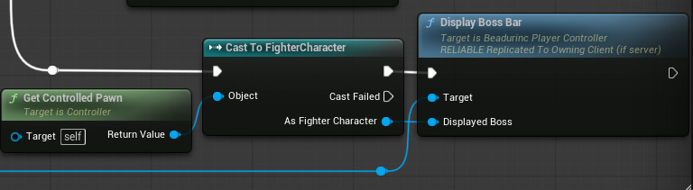
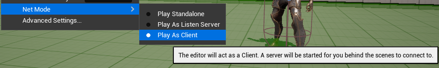
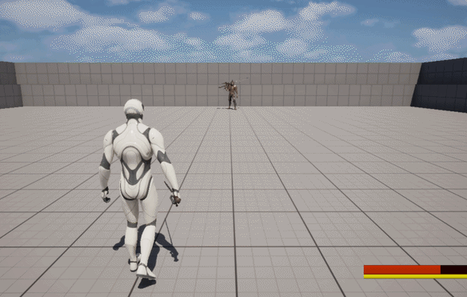

# RPC (Remote Procedure Call)

- 클라이언트, 서버 모델을 채택한 모든 프로그램은 동기화 처리가 필수적임
- 언리얼 엔진은 클라이언트와 서버간의 동기화를 위해 RPC라는 개념을 도입함
- 이는 프로그래머가 별도의 제어 없이 함수 혹은 프로시저를 원격으로 호출할수 있게 도움

## RPC 예시

**ABeadurincPlayerController.h**
```c++
/**
 * Adds a boss stat bar
 * @param DisplayedBoss A boss character that will bound to widget
 */
UFUNCTION(Client, Reliable, BlueprintCallable)
void DisplayBossBar(const AFighterCharacter* DisplayedBoss);

/**
 * Removes a boss stat bar
 * @param DisconnectedBoss A boss character who will be removed from boss bars
 */
UFUNCTION(Client, Reliable, BlueprintCallable)
void CloseBossBar(const AFighterCharacter* DisconnectedBoss);
```

**UFUNCTION** 매크로에서 RPC와 관련된 인자들을 넘겨줄 수 있으며 인자로 올 수 있는 값들은 다음과 같다.

## 실행 위치
- **Client:** 함수가 클라이언트에서만 실행됨. 서버에서 호출되면 클라이언트로 자동 동기화 (서버에서 미실행)
- **Server:** 함수가 서버에서만 실행됨. **Client**와 반대로 클라이언트에서 호출되면 서버로 자동 동기화 (클라이언트에서 미실행)
- **NetMulticast**: 함수가 서버에서 호출될 시 서버와 모든 클라이언트에서 실행됨. 클라이언트에서는 동기화 일어나지 않음.

## 신뢰성
- **Reliable**: 함수의 실행이 반드시 보장됨. 신뢰성이 중요한 통신에 주로 사용 (플레이어의 아이템 획득이나 스킬 해금 등)
- **Unreliable**: 함수의 실행이 보장되지 않지만 속도가 빠르다. 최적화가 중요한 통신에 주로 사용 (몬스터의 위치, 회전 정보 업데이트 등)

## RPC 적용 예시

잠입 액션 게임 등에서 레벨 안의 몬스터가 플레이어를 인식할 때 알람을 보내는 기능이 있다. 만약 이 같은 행위를 멀티플레이어에서
구현한다면 실행되는 작업은 다음과 같다.

> 서버
> 
> AI컨트롤러에서 적 탐지 -> 탐지된 적이 플레이어인지 체크 -> 플레이어 컨트롤러에서 발각됨을 나타내는 **RPC 함수** 호출 -> RPC를 통해 클라이언트로 정보 전송
>
> 클라이언트
> 
> RPC를 통해 클라이언트의 플레이어 컨트롤러에서 해당 함수 실행 -> 사운드, UI등 처리

몬스터의 플레이어 감지 이벤트는 서버에서 발생하는데, 이것을 플레이어에게 알리기 위해선 클라이언트에서 UI활성화나 알림음을 재생하여야
한다.

`DisplayBossBar` 함수와 `CloseBossBar` 함수는 클라이언트에서 보스 체력, 스태미나를 표시하는 **ProgressBar**를 화면에 표시하기
위한 함수들이다. 만약 이 함수들이 서버에서 호출되면 언리얼은 자동적으로 네트워크 소유자(플레이어)에게 해당 함수 실행에 필요한 정보를
전송하여 "함수를 호출하는 행위" 자체를 복제한다.

> 주의사항: RPC를 사용하는 함수의 구현은 `_Implementation` 접두사를 붙혀야 언리얼 엔진에서 인식이 가능함.
> 
> **ABeadurincPlayerController.cpp**
> ```c++
> /**
> * Adds a boss stat bar (Should be suffixed by `_Implementation` to follow RPC's convention)
> * @param DisplayedBoss A boss character that will bound to widget
> */
> void ABeadurincPlayerController::DisplayBossBar_Implementation(const AFighterCharacter* DisplayedBoss)
> {
>     ...
> }
> ```

아래 예시는 `BP_FighterController` 블루프린트의 일부분으로 `AIController`를 상속하여 만든 블루프린트다. 여기서 RPC로 만든 함수를
호출하는데 해당 함수 호출의 시점은 몬스터가 플레이어를 감지를 시작한 시점으로 서버 사이드이다.

RPC를 클라이언트로 설정하였으므로 자동으로 `PlayerController`의 소유자, 즉 컨트롤러를 소유한 플레이어의 클라이언트 사이드로 함수
실행이 복제된다.



*결과*

서버-클라이언트 연결을 테스트해야하므로 Play As Client에 체크하였다





몬스터가 플레이어를 감지하면 화면 상단에 HealthBar가 나타나며 플레이어가 멀어져서 더이상 몬스터가 플레이어를 감지하지 않으면
HealthBar가 사라진다.

HealthBar를 구현한 문서는 [이곳](UI.md)을 참조