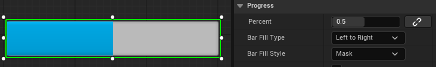
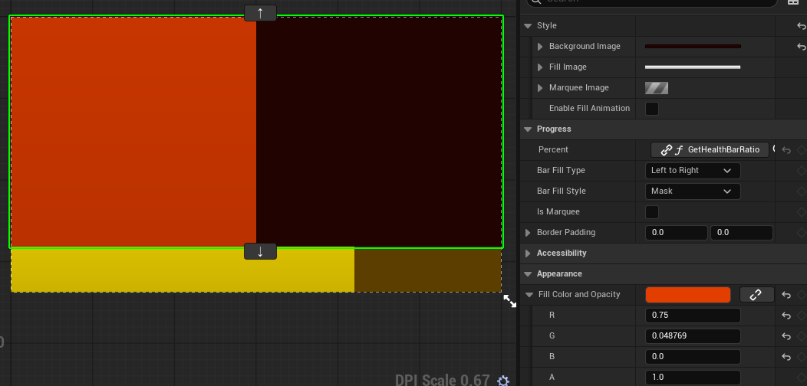
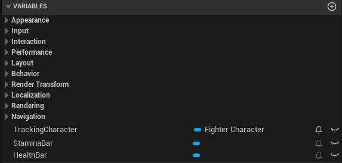
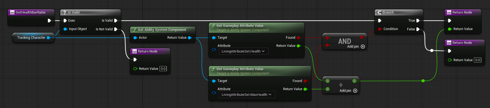
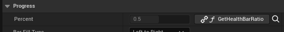

# UI (User Interface)
___
- 게임 내 다양한 정보들을 유저가 식별할 수 있도록 시각화한 장치
- 언리얼 엔진의 모든 UI는 **Widget Blueprint**를 이용하여 만들 수 있음
- 또한, 월드 내 상호작용과 UI 컴포넌트를 중개하는 HUD라는 클래스도 존재함
___
# Widget

- 언리얼 엔진에서 제공하는 화면을 구성하는 기능성 컴포넌트
- 기본 제공되는 Widget 외에, 사용자가 기존 Widget들을 임의로 구성하여 또다른 Widget을 구성할 수 있음
- 디자인 외에 변수와 함수를 통해 Widget의 상태를 변경하는 기능적인 부분도 설계 가능함

# 구현
___
## 체력, 스태미너를 표시하는 Health Bar 구현

- **Progression Bar**
  - 진행 상황을 비율로 표시하는 위젯
  - 최대값과 현재값의 대비를 표현하는데 탁월

  - 위 사진과 같이 Percent값을 0.5로 설정하면 왼쪽으로부터 절반이 채워지는 것을 확인할 수 있음
___
## 디자인

- 칠하기 색상은 밝게, 배경색상은 어두운 색으로 표현하여 사용자가 한눈에 대비를 알아볼 수 있도록 함
- 보편적으로 인식되는 체력, 스태미나의 색상은 각각 붉은색, 노란색이라 생각하여 해당 색상으로 결정
___
## 위젯에 데이터 바인딩하기

시시각각으로 변하는 게임 내 정보들을 표현하기 위해서는 변화에 맞춰 위젯의 상태 또한 변해야한다. 언리얼 엔진에서는 위젯 디자인 뿐만
아니라 위젯의 시각적인 변화를 담당하는 로직도 Blueprint와 동일하게 설정이 가능하다.

### 변수, 함수 정의

우선 정보를 표시할 캐릭터 오브젝트 레퍼런스 변수를 선언하였다. 이 값은 외부에서 캐릭터 생성 혹은 빙의시 설정될 것이다. 캐릭터의
속성값을 가지고 있는 `AttributeSet` 오브젝트는 `AFighterCharacter`의 `AbilitySystemComponent`에 속해 있으므로 변수 타입을
`AFighterCharacter`로 설정하였다.

그 다음, 현재/최대 체력의 비율을 계산하는 `GetHealthBarRatio`와 `GetStaminaBarRatio` 함수를 설정하였다. 아래 블루프린트 캡쳐는
`AbilitySystemComponent`에서 두 속성값을 추출하여 비율로 반환하는 로직을 나타낸 것이다. (체력값을 리턴하며, 스태미나 비율을 구하는
함수도 사실상 동일함)

마지막으로 ProgressionBar의 진행도에 해당 함수의 리턴값을 바인딩 해주었다.

*결과*

위 결과물은 [Attribute](Attribute.md) 문서의 결과물과 동일하다. 해당 문서는 플레이어의 속성값(체력, 스태미나)를 설정하는
`AttributeSet`에 대한 자세한 설명이다.