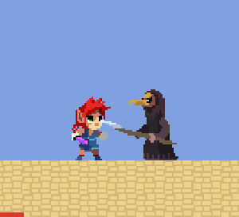
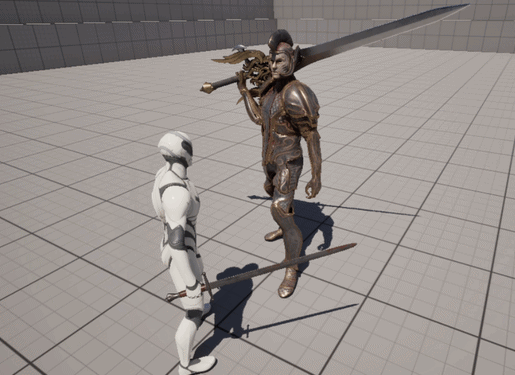
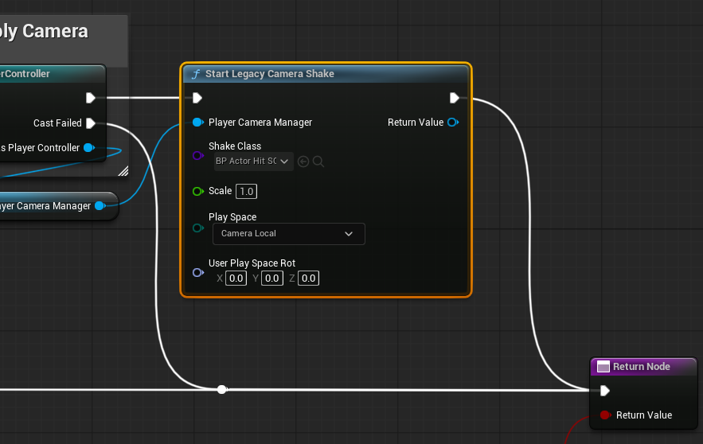

# Hit Stop, Camera Shake

좋은 타격감은 유저 경험을 향상시키는 가장 빠르고 확실한 방법으로 플레이어나 몬스터의 공격이 *아프겠다* 고 느껴지게 만든다. 여기에는
사운드 이펙트, 파티클 등 높은 퀄리티의 에셋이 사용될 수도 있지만 심플하면서도 모든 상황에 적용될 수 있는 강력한 기법이 있다.

Hit Stop은 데미지 적용이 이루어지는 시점에 공격자 혹은 피격 대상의 애니메이션 재생을 아주 짧은 시간동안 정지시키는 의도적인 멈춤을
의미한다. 이는 공격이 이루어지는 시점의 캐릭터의 포즈를 부각시켜 시각적인 잔상이 더 오래 남도록 만든다.

Hit Stop 구현에 주의할 점이 있는데 애니메이션 재생이 중단되는 시간이 게임플레이에 영향을 미쳐서는 안되는 짧은 시간만 이루어져야
한다는 점이다. 멀티플레이어와 같은 환경에서 캐릭터가 Hit Stop 때문에 너무 오랜 시간동안 정지한다면 이는 단순 이펙트를 넘어 게임
플레이 자체에 영향을 주는 패널티로 작용하게 된다.

*스트리트 파이터의 Hit Stop 예시*


Camera Shake는 Scene을 렌더링하는 카메라의 위치나 회전에 노이즈를 가하여 화면 전체가 떨리는 효과를 도출한다. 이 기법은 긴박한
상황, 자연재해와 같은 극적인 상황을 연출하는데 주로 쓰인다. 대전 액션 게임에서는 주로 짧은 시간동안, 상대적으로 적은 진폭을 통해
타격감을 끌어올린다.

*피격시 CameraShake예시*



## HitStop 구현

**UHitReactGameplayAbility.cpp**
```c++
void UHitReactGameplayAbility::ActivateAbility
(
	const FGameplayAbilitySpecHandle Handle,
	const FGameplayAbilityActorInfo* ActorInfo,
	const FGameplayAbilityActivationInfo ActivationInfo,
	const FGameplayEventData* TriggerEventData
)
{
  AFighterCharacter* OwnerCharacter = Cast<AFighterCharacter>(ActorInfo->AvatarActor.Get());
  UAbilitySystemComponent* OwnerACS = ActorInfo->AbilitySystemComponent.Get();
  
  if (OwnerCharacter && OwnerACS)
  {
    FGameplayCueParameters CueParams;
    FGameplayEffectContextHandle Context = OwnerACS->MakeEffectContext();
    
    ...
    
    // Apply Hit Stop if the interacting actors are fighters
    if (AFighterCharacter* Attacker = Cast<AFighterCharacter>(CueParams.Instigator))
    {
      Attacker->HitStopForTime(HitStop);
    }

    ...
}
```

**AFighterCharacter.cpp**
```c++
void AFighterCharacter::HitStopForTime(const float StopTime)
{
  CustomTimeDilation = 0.0F;
  FTimerHandle HitStopTimerHandle;
  
  GetWorldTimerManager().SetTimer(
    HitStopTimerHandle,
    FTimerDelegate::CreateLambda([this]{ CustomTimeDilation = 1.0F; }),
    StopTime,
    false
  );
}
```

언리얼에서 제공하는 타이머 함수를 통해 주어진 시간동안 `CustomTimeDilation` 을 0.0으로 설정함. `CustomTimeDilation` 은 특정
액터의 시간 지연을 설정하는데 사용되며 전체 월드 시간을 지연하는 대신 대상 액터만의 시간을 지연시킴으로서 추후 멀티플레이어 구현
시에도 동작할 수 있도록 만듬.

*결과*



## Camera Shake 구현

언리얼 엔진에서 자체적으로 지원하는 CameraShakeLegacy Blueprint를 사용하여 CameraShake를 구현함. 이 효과는 PlayerController
마다 적용되므로 HitReact가 발동한 플레이어 하나만을 콕 집어서 Camera Shake를 재생할 수 있는 장점이 있음.

**GC_MeleeBlock**, **GC_MeleeHurt**


*결과*


진동 강도와 지속시간은 플레이어에게 의식적으로 느껴지지 않을 정도로 설정함.