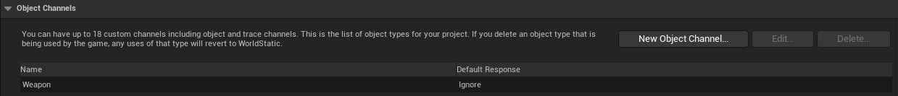
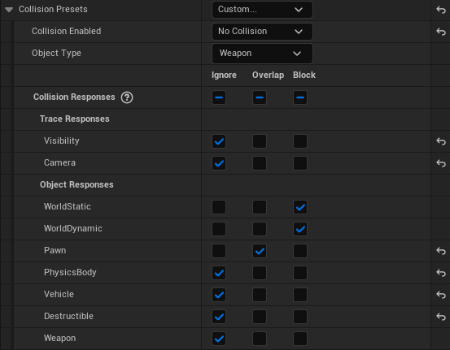

# WeaponActor 클래스
- `FighterCharacter`가 소유할 수 있는 무기를 정의한 클래스
- `FighterCharacter`의 Blueprint에서 설정할 수 있으며 `FighterCharacter`가 스폰될 때 같이 스폰됨
- 기본 데미지와 애니메이션 몽타주 배열을 설정할 수 있으며 해당 애니메이션들은 플레이어가 공격 버튼을 누를 시 순차적으로 재생됨 (콤보공격)

## Collision 설정
- 무기 또한 액터이므로 **Collision**을 가질 수 있고, 월드 내의 다른 Object들과 함께 시뮬레이션 될 수 있음
- 따로 설정해 주지 않으면 소유자와도 충돌하여 비정상적인 충돌 반응을 의미하는 **시뮬레이션 폭발**을 일으킬 수도 있음
- Unreal Engine의 충돌은 충돌 레벨이 높은 설정을 우선시하기 때문에 `WeaponActor`와 소유자의 Blueprint에서 모두 충돌을 비활성화 
  해주어야 함

우선 무기 액터들의 커스텀 충돌 타입을 설정하기 위해 프로젝트 세팅에서 Weapon이라는 오브젝트 채널을 추가하였다. (기본값은 "Ignore")

그런 다음 `WeaponActor`의 Blueprint에서 각 ObjectType과의 충돌 설정을 세팅해주었다. Weapon타입의 기본값이 Ignore이므로
`WeaponActor`에서의 충돌 레벨만 높이면 소유자의 충돌 설정은 따로 할 필요가 없다. 여기서는 캐릭터와의 충돌 감지만을 원하므로 Pawn
타입과의 충돌에 Overlap을 주었다.

**WorldStatic**, **WorldDynamic**에는 Block을 체크해주었는데 이는 `WeaponActor`가 누구에게도 소유되지 않고 독립적으로 존재할 때 지형을
통과하며 떨어지는 것을 방지하기 위해서이다. 

